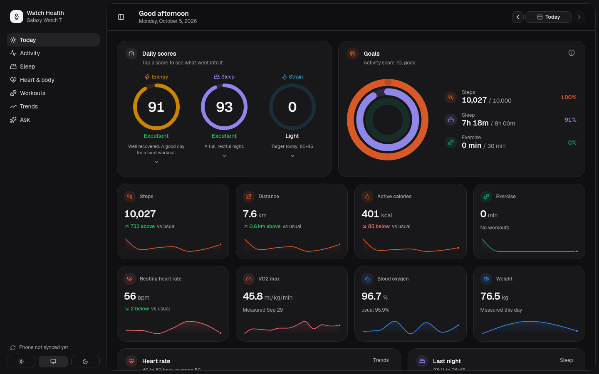
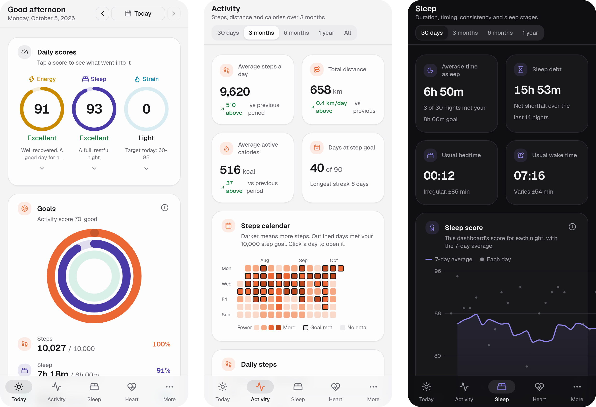
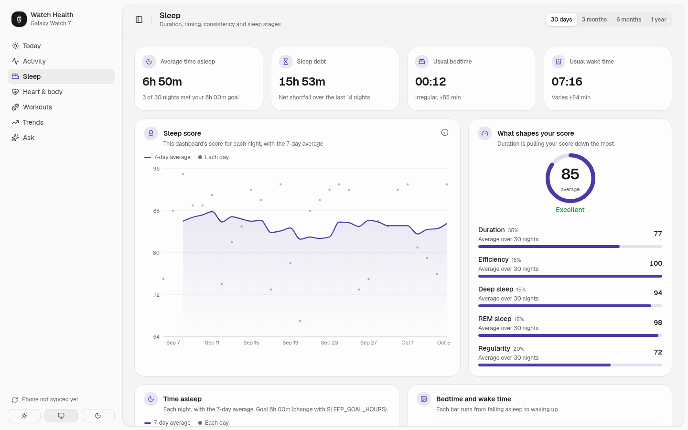
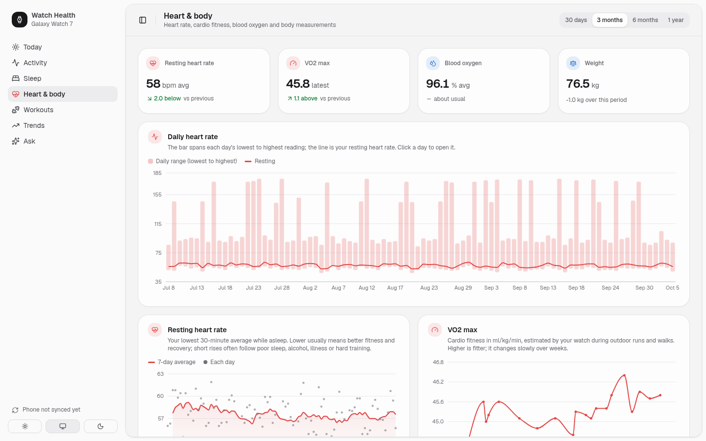
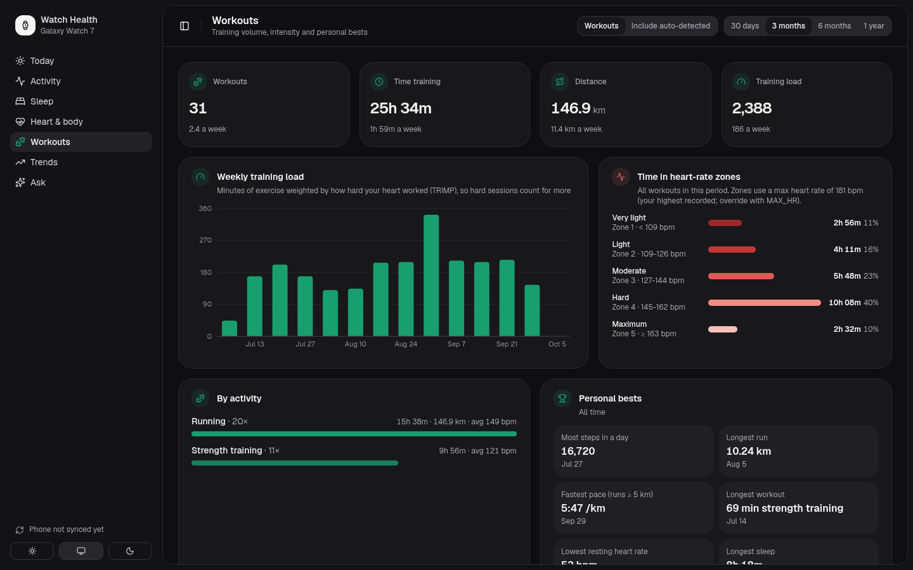
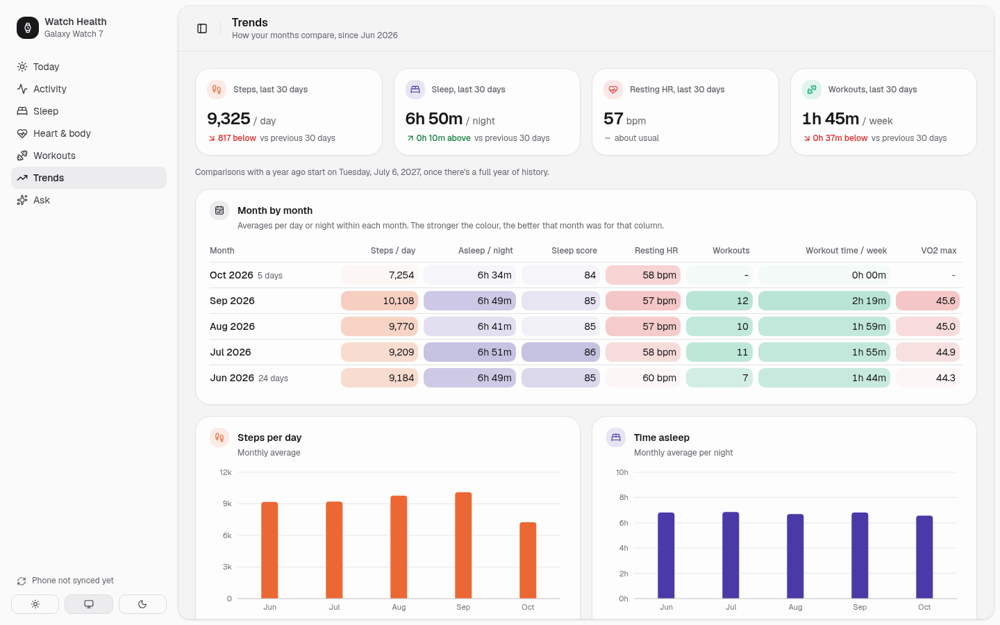

# Watch Health

A self-hosted dashboard for your Samsung Galaxy Watch data: a cleaner alternative to the Samsung Health app.
It also has an AI assistant you can ask questions about your sleep, activity and heart data.

It runs on your own computer. Your health data stays there; nothing is uploaded to a cloud service.



<p align="center">
  
</p>

## What you get

- **Today:** daily scores for energy, sleep and strain, goal rings, and how today compares with your usual
- **Activity, Sleep, Heart & body, Workouts:** charts for 30 days up to a year, with personal bests
- **Trends:** the last 30 days against the 30 before, and a month-by-month table
- **Ask:** an assistant (Claude) that looks up your data to answer questions like "Do I sleep better on days I work out?"
- **A phone app:** install it from Chrome on Android, with bottom tabs, haptics and light/dark mode

| Sleep | Heart & body |
|---|---|
|  |  |
| **Workouts** | **Trends** |
|  |  |

## How it works

```
Galaxy Watch → Samsung Health → Health Connect → Watch Sync (Android app in android/)
                                                      │  sends new data over your Wi-Fi
                                                      ▼
                                    Dashboard (Next.js in web/) on your computer
                                    stores everything in SQLite (data/health.db)
```

Samsung Health shares your watch data with Android's Health Connect. A small companion app, **Watch Sync**,
reads it and sends it to the dashboard on your computer. Your older history comes from a one-time
Samsung Health export.

## Try it with demo data

You need [Node.js](https://nodejs.org) 22.5 or newer.

```sh
cd web
npm install
npm run seed:demo   # creates data/demo.db with 120 days of made-up data
npm run dev:demo    # open http://localhost:4747
```

## Set it up with your own data

### 1. Start the dashboard

```sh
cd web
npm install
cp .env.example .env.local
```

Open `.env.local` and set `INGEST_TOKEN` to a random secret (`openssl rand -hex 24` makes one). Watch Sync
uses it to prove it's allowed to send data. Then run:

```sh
npm run build && npm start   # http://localhost:4747
```

Use `npm run dev` instead while you're changing the code.

### 2. Import your history

1. On your phone, open Samsung Health → ⋮ → Settings → **Download personal data** → Download.
2. Copy the `Download/Samsung Health/samsunghealth_*` folder to your computer.
3. In `web/`, run `npm run import:shealth -- /path/to/samsunghealth_xxx`.

It lists which files it used and which it skipped. It's safe to run again.

### 3. Install Watch Sync on your phone

You need Android 9 or newer, and JDK 17+ on your computer to build the app.

1. In Samsung Health, go to Settings → **Health Connect** and turn on syncing.
2. Connect your phone over USB with USB debugging on, then run `cd android && ./gradlew installDebug`.
   Or build it and copy `android/app/build/outputs/apk/debug/app-debug.apk` to the phone.
3. Open **Watch Sync**, enter `http://<your computer's local IP>:4747` and your `INGEST_TOKEN`, then tap
   **Grant access** and **Sync now**. Turn on hourly sync if you like.

Watch Sync reads up to 30 days back. Background sync only runs on Wi-Fi, and quietly retries if your
computer is off.

### 4. Optional: use it as an app on your phone

Chrome can install the dashboard as an app, but only from an HTTPS address. [Tailscale](https://tailscale.com)
gives you one, and it also lets your phone reach the dashboard when you're away from home. The
connection goes directly between your own devices.

1. Install Tailscale on your computer and log in: `curl -fsSL https://tailscale.com/install.sh | sh`, then
   `sudo tailscale up`.
2. In the Tailscale admin console, go to **DNS** and turn on **HTTPS Certificates**.
3. Run `sudo tailscale serve --bg 4747`. It prints your address, like `https://my-pc.tail1234.ts.net`.
   Only your own devices can open it. Don't use `tailscale funnel`, which would put it on the internet.
4. Install the Tailscale app on your phone and log in with the same account.
5. Open your address in Chrome, then tap ⋮ → **Add to Home screen** → **Install**.

You can also enter this address in Watch Sync, so it syncs on any Wi-Fi network. Pull down on a page to
refresh it. The HTTPS certificate makes your machine and tailnet names visible in public certificate logs.

### 5. Optional: start it automatically

On Linux, run the dashboard as a systemd user service so it starts at boot. Save this as
`~/.config/systemd/user/watch-health.service`. Change the project path, and the Node path from `which node`:

```ini
[Unit]
Description=Watch Health dashboard
After=network-online.target
Wants=network-online.target

[Service]
WorkingDirectory=%h/Projects/gw-dashboard/web
Environment=PATH=%h/.nvm/versions/node/v26.7.0/bin:%h/.local/bin:/usr/local/bin:/usr/bin
Environment=NODE_ENV=production
ExecStart=%h/.nvm/versions/node/v26.7.0/bin/npm start
Restart=on-failure
RestartSec=5

[Install]
WantedBy=default.target
```

Then run:

```sh
systemctl --user enable --now watch-health
loginctl enable-linger   # start at boot, before you log in
```

After changing the code, run `npm run build && systemctl --user restart watch-health`. To see the logs,
run `journalctl --user -u watch-health -f`.

## The assistant

The **Ask** page uses Claude to answer questions about your data. It can only read your data, through
a read-only connection. Each lookup it makes is shown under its answer.

By default it uses the [Claude Code](https://claude.com/claude-code) installed on your computer, so your
Claude subscription covers it. Run `claude` once to log in. To use an Anthropic API key instead, set
`ANTHROPIC_API_KEY` in `web/.env.local`.

The rows it reads while answering are sent to Anthropic. The rest of the dashboard never sends data
anywhere.

## Settings

All optional, in `web/.env.local`:

| Setting | What it does | Default |
|---|---|---|
| `STEPS_GOAL` | Daily steps goal | 10000 |
| `SLEEP_GOAL_HOURS` | Nightly sleep goal | 8 |
| `EXERCISE_GOAL_MIN` | Daily exercise goal | 30 |
| `MAX_HR` | Max heart rate, for heart-rate zones | Highest recorded in a workout |
| `HEIGHT_CM` | Your height, to estimate walking distance from steps | 0.76 m stride |
| `ANTHROPIC_API_KEY` | Use the Anthropic API for Ask instead of Claude Code | Not set |
| `HEALTH_DB_PATH` | Where the database lives | `data/health.db` |

## Privacy and security

- Your data stays in `data/` on your computer, and git ignores that folder.
- The dashboard has no login. Anyone on your home network, or your tailnet, can open it. Watch Sync needs
  the `INGEST_TOKEN` to send data.
- The only data that leaves your computer is what the assistant reads while answering a question.

## Good to know

- **Not medical advice.** The scores are this project's own estimates, not Samsung's and not medical measurements.
- **Some metrics aren't available.** Samsung Health doesn't share resting heart rate, HRV, Energy Score or ECG
  with Health Connect. Resting heart rate is worked out from your heart rate while asleep, and there's no HRV.
- **Distance is estimated.** Samsung only shares distance for workouts, so daily distance also counts steps × stride length.
- **Auto-detected workouts** (short walks and "other" activities) are hidden on the Workouts page by default,
  but they still count as exercise.

<details>
<summary><strong>How the scores work</strong></summary>

All three are 0–100: 85+ excellent, 70–84 good, 55–69 fair, below 55 low. Each is a weighted average of
named parts, so the dashboard can always show what pulled a score down. Parts marked "vs usual" compare
against your own last 30 days. The rules are in `web/src/lib/scores.ts`.

| Score | Parts (weight) |
|---|---|
| **Sleep** (per night) | duration vs goal (35), efficiency (15), deep sleep share (15), REM share (15), bedtime regularity (20) |
| **Energy** (each morning) | last night's sleep (30), resting HR vs usual (25), 7-night sleep balance (15), recovery from training load (20), bedtime consistency (10). A resting HR 5+ bpm above usual caps the score. |
| **Activity** (per day) | steps vs goal (60), exercise over the last 7 days vs 150 min (30), exercise today (10) |

Resting heart rate is your lowest 30-minute average heart rate while asleep.

</details>

<details>
<summary><strong>Database tables</strong></summary>

| Table | Holds |
|---|---|
| `samples` | One row per measurement: heart rate, SpO₂, weight, body composition, blood pressure, VO₂ max, workout speed, cadence, power and elevation, hydration, nutrition, … |
| `daily_metrics` | Daily totals for steps, distance, calories and floors, de-duplicated across phone and watch |
| `sleep_sessions` / `sleep_stages` | Nights, and their deep, light, REM and awake segments |
| `exercise_sessions` | Workouts with duration, distance, calories and average/max heart rate |
| `exercise_routes` | GPS points recorded during workouts |

Saved Ask conversations are in a separate file next to the database (`health-chats.db`).

</details>

<details>
<summary><strong>Watch Sync details</strong></summary>

The first sync, and **Re-sync last 30 days**, start 30 days back. Later syncs start from the last sync,
with a 2-day overlap to catch data the watch delivered late. Samsung's export CSV columns aren't formally
documented, so if a metric is missing after importing, add a handler in `web/scripts/import-shealth.ts`.

</details>

## License

[MIT](LICENSE)
